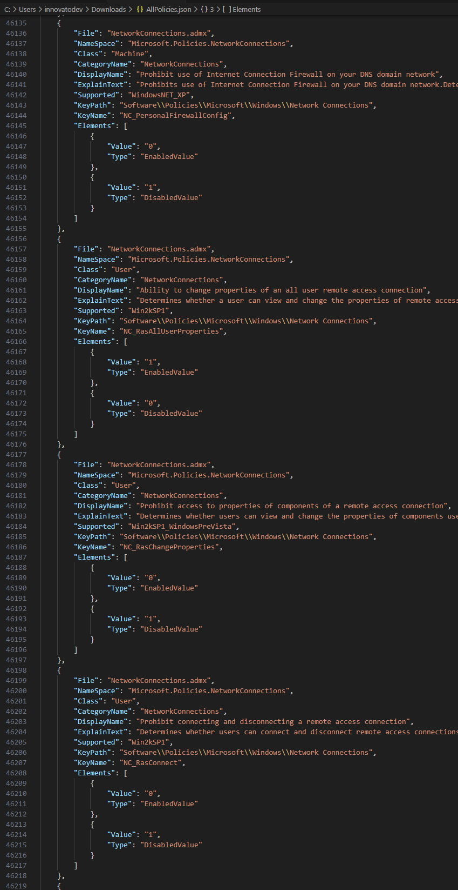

# WindowsAdmxParser

Module to parse Admx Policies Settings from a given PolicyDefinitions folder.

It automatically uses found languages (en-GB, fr-FR, etc.), and fallbacks to en-US when necessary.

## HowTo

Install it:

`Install-Module -Name WindowsAdmxParser`

Or simply import it:

`Import-Module .\Module\WindowsAdmxParser.psd1 -Force`

## Examples

```powershell
$Policies = Invoke-WindowsAdmxParser -DefinitionsPath "C:\Windows\PolicyDefinitions" -IgnoredAdmx "inetres"
$Policies | ConvertTo-Json -Depth 100 | Out-File "$env:USERPROFILE\Downloads\AllPolicies.json" -Force
```

Parses local computer's Definitions, ignoring "Internet Explorer" policies and then export them to JSON inside of user's Downloads folder.

<div align="center">



</div>
